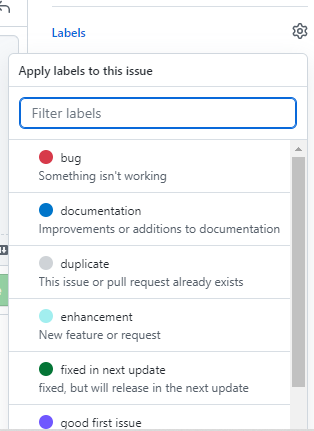

# Boss Fights Sandbox

The new sandbox game with the Boss Fights idea!

This game is still in the development stage.

## Contents:

### Download the game!
[Download here!](https://drive.google.com/uc?export=download&confirm=yTib&id=1qrpe0llZtW-_Pc8Lw_tWTllHh0ynKe6p)

This link downloads the built code from the launcher code (link below) as an exe.

If you need troubleshooting help, use the _issues_ tab, and [submit a help document](https://github.com/MM4096/Boss-Fights-Sandbox#help)

### Game source code:
Unfortunately, the source code for the game will not be published. However, if you want to check the launcher code, go [here](https://github.com/MM4096/Boss-Fights-Sandbox/blob/main/main.py)

### Issues/Requests:
All issues and requests can be added in the *issues* tab, or [here](https://github.com/MM4096/Boss-Fights-Sandbox/issues). If you are submitting issues, make sure to label the issue with whatever it is.

Please **_DO NOT_** use any tag other than _bug_, _documentation_ or _enhancement_.

Remember to make sure you add enough details to make any sort of report or request, or it will get ignored.
Here is an issue template: [issue template](https://github.com/MM4096/Boss-Fights-Sandbox/issues/5)

Please only submit one bug for each issue

### Help:
To submit a help document, create a new issue, and add the _help_ tag.

### Changelog:
#### V0.3 (earliest documented)
- Day-light cycle time increased
- Fixed 2 bugs
- Pause menu added
